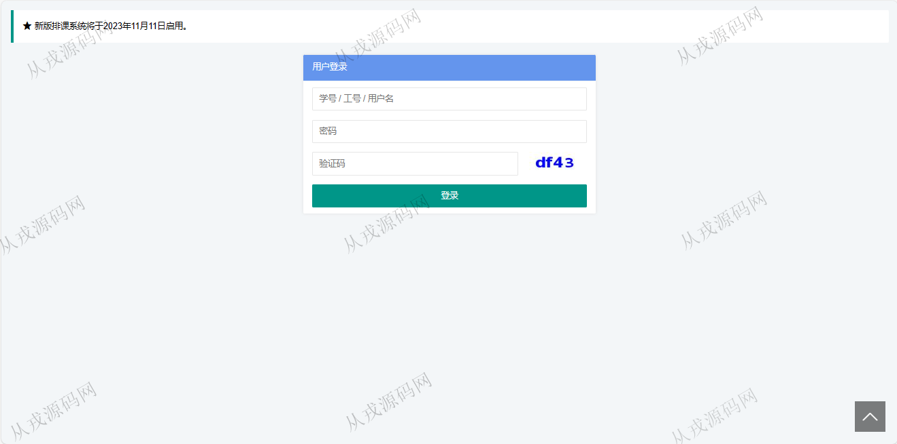
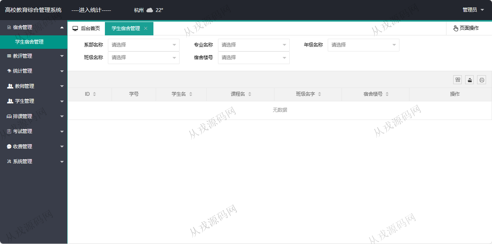
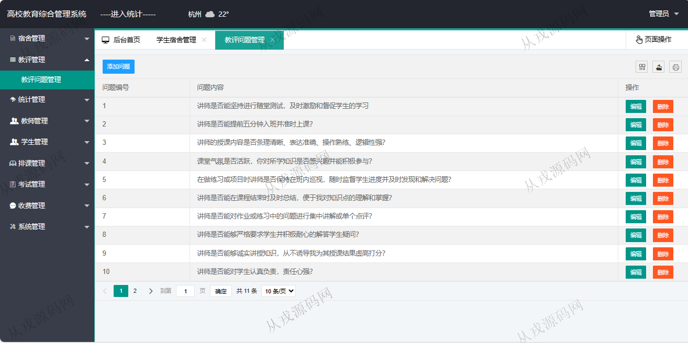
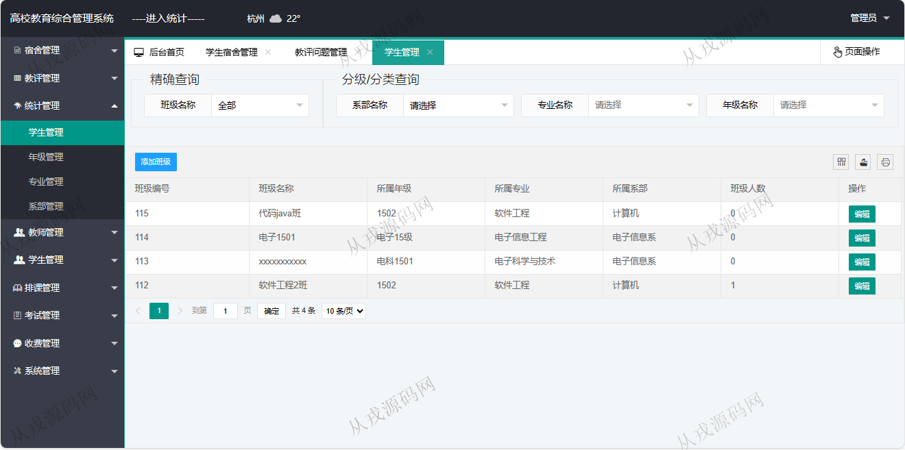
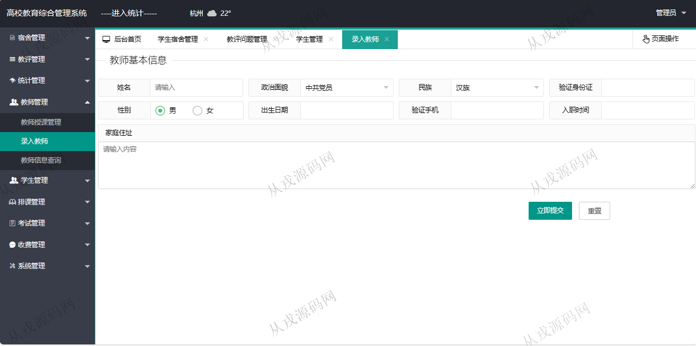
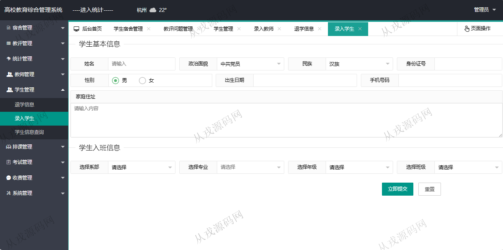
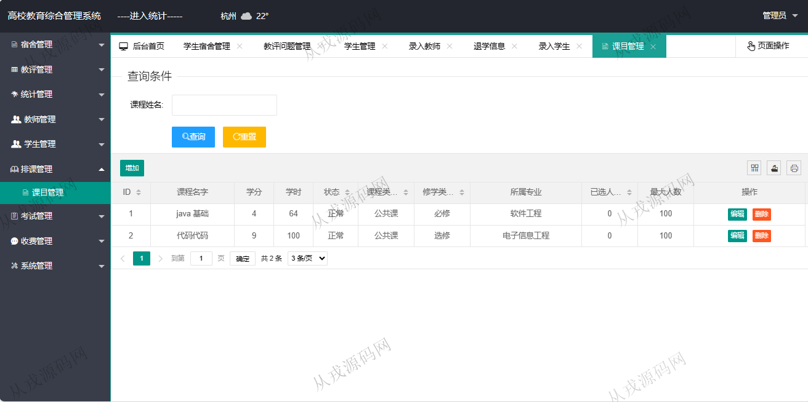
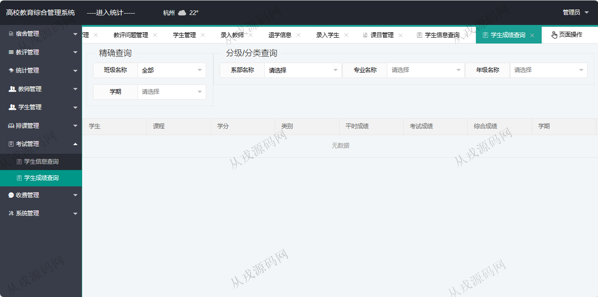
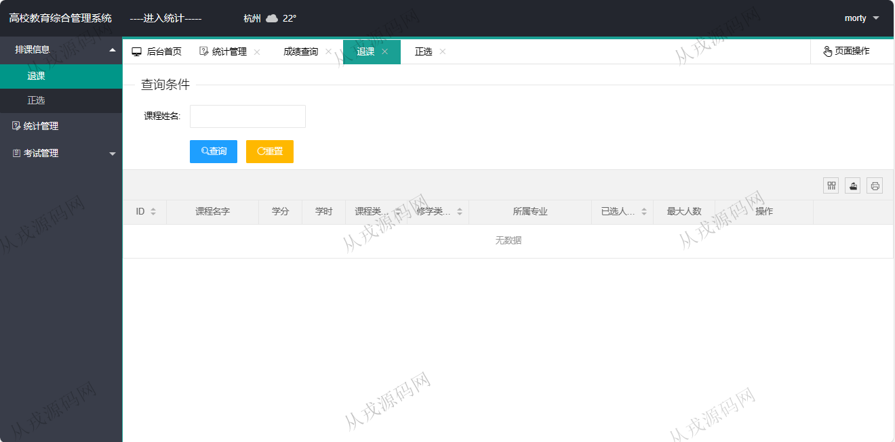

<h1 align="center">231.基于springboot的高校教育综合管理系统</h1>

 获取sql文件 QQ: 386869957 QQ群: 377586148 

 [更多源码项目: 从戎源码网](https://armycodes.com/) 

## 简介

> 本代码来源于网络,仅供学习参考使用!
>
> 提供1.远程部署/2.修改代码/3.设计文档指导/4.框架代码讲解等服务
> 
> 登录地址：http://localhost:8080/
>
> 老师: 2020001   密码: 123456
> 
> 学生: 15020002   密码: 123456
>
> 管理员: admin   密码: 123456
>

## 项目介绍
基于springboot的高校教育综合管理系统：前端 html、jquery、layui，后端 maven、springmvc、spring、mybatis；角色分为管理员、老师、学生；集成宿舍管理、教评管理、排课管理、考试管理等功能于一体的系统。

## 环境

- <b>IntelliJ IDEA 2021.3</b>

- <b>Mysql 5.7.26</b>

- <b>JDK 1.8</b>

## 运行截图

